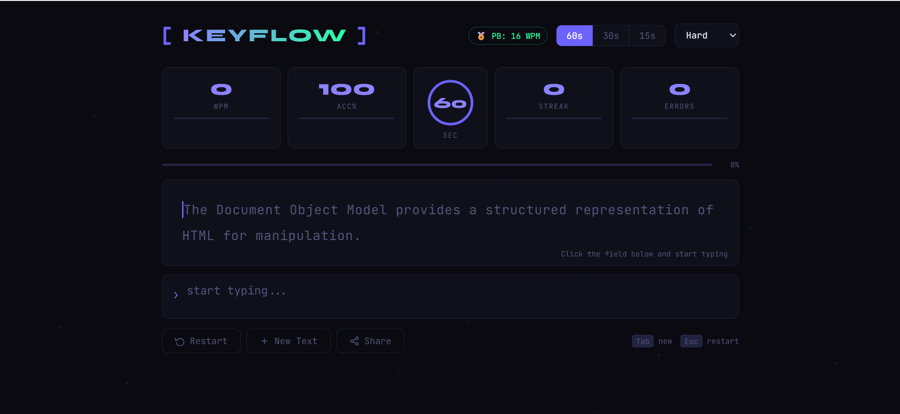

# web-site-typing-test-speed-with-javascript

# Typing Speed Test Website ⌨️⚡


A modern and interactive typing speed test website built using **HTML, CSS, and JavaScript**.
This project helps users measure their typing speed, accuracy, and reaction time in real-time while practicing keyboard skills.
<div align="center">

```
██╗  ██╗███████╗██╗   ██╗███████╗██╗      ██████╗ ██╗    ██╗
██║ ██╔╝██╔════╝╚██╗ ██╔╝██╔════╝██║     ██╔═══██╗██║    ██║
█████╔╝ █████╗   ╚████╔╝ █████╗  ██║     ██║   ██║██║ █╗ ██║
██╔═██╗ ██╔══╝    ╚██╔╝  ██╔══╝  ██║     ██║   ██║██║███╗██║
██║  ██╗███████╗   ██║   ██║     ███████╗╚██████╔╝╚███╔███╔╝
╚═╝  ╚═╝╚══════╝   ╚═╝   ╚═╝     ╚══════╝ ╚═════╝  ╚══╝╚══╝
```

### ⌨️ A precision typing speed test — built with zero dependencies

[](https://web-site-typing-test-speed-with-jav.vercel.app/)
[](https://developer.mozilla.org/en-US/docs/Web/HTML)
[](https://developer.mozilla.org/en-US/docs/Web/CSS)
[](https://developer.mozilla.org/en-US/docs/Web/JavaScript)
[](LICENSE)

</div>

---

## 📖 What Is KEYFLOW?

**KEYFLOW** is a fully client-side typing speed test — no backend, no framework, no build step.
Open a browser and start typing.

The idea is simple: measure how fast and accurately you type. But the execution goes deep.
Every keystroke is tracked in real time. WPM is recalculated every second. Errors are highlighted immediately. A streak counter rewards consistency. And when the time runs out, you get a full results breakdown with a live WPM chart drawn on canvas.

This project was built to prove that you don't need React, Vue, or any library to build something that feels polished and alive. Just the web platform, used well.

> **"The constraint of using only HTML, CSS, and JavaScript isn't a limitation — it's the challenge."**

---

## 🌐 Live Demo

🔗 **[keyflow.vercel.app](https://web-site-typing-test-speed-with-jav.vercel.app/)**

No install. No sign-up. Open and type.

---

## ✨ Features at a Glance

| Feature | Details |
|---|---|
| ⚡ **Live WPM** | Recalculates every second as you type |
| 🎯 **Accuracy %** | Tracks correct vs total keystrokes |
| 🔥 **Best Streak** | Consecutive correct characters |
| ❌ **Error Counter** | Highlights every wrong character instantly |
| ⏱ **3 Timer Modes** | 15s · 30s · 60s — personal bests tracked per mode |
| 📊 **WPM Chart** | Canvas-drawn graph of your speed over time |
| 🎚 **5 Difficulty Levels** | Easy · Medium · Hard · Code · Darija 🇲🇦 |
| 💾 **Personal Bests** | Saved in localStorage, never lost |
| ⌨️ **Keyboard Shortcuts** | `Tab` = new text · `Esc` = restart |
| 📋 **Share Result** | One-click clipboard copy |
| 🌌 **Particle Background** | Animated canvas — subtle, not distracting |
| 📱 **Fully Responsive** | Mobile and desktop |

---

## 🚀 Getting Started

### Option 1 — Just open it

```bash
git clone https://github.com/AymenElyaakoubi/keyflow.git
cd keyflow
open index.html       # macOS
start index.html      # Windows
xdg-open index.html   # Linux
```

No npm install. No build. It works.

### Option 2 — Serve locally (recommended for development)

```bash
# Node.js
npx serve .

# Python
python -m http.server 8080

# PHP
php -S localhost:8080
```

Then open `http://localhost:8080` in your browser.

---

## 🗂 Project Structure

```
keyflow/
│
├── index.html          ← App shell, layout, DOM structure
├── style.css           ← All styling: variables, grid, animations, responsive
├── typing-test.js      ← All logic: state, timer, canvas, rendering, storage
└── README.md           ← You are here
```

Three files. That's the whole project. Intentionally.

Most developers reach for a framework before writing a single line of logic.
This project proves that **structuring vanilla JS well** produces code that's readable, fast, and maintainable — without any toolchain complexity.

---

## 🏗 How It Works — Under The Hood

### State Management

Everything lives in a single `state` object:

```js
const state = {
  currentText: "",      // the paragraph the user must type
  typed: "",            // what the user has typed so far
  timeLeft: 60,         // seconds remaining
  totalTime: 60,        // selected timer mode
  started: false,       // has the test begun?
  finished: false,      // has the test ended?
  correctChars: 0,      // correctly typed characters
  totalTyped: 0,        // total keystrokes
  bestStreak: 0,        // longest consecutive correct run
  errorCount: 0,        // current wrong characters
  wpmHistory: [],       // one WPM snapshot per second (for chart)
};
```

No Redux. No signals. No reactive framework.
Just a plain object, mutated intentionally, and a `updateDisplay()` function that reads from it and updates the DOM.

This is a deliberate architectural choice — it makes the data flow **100% traceable** by reading the code top to bottom.

---

### The Typing Engine

The core logic runs inside a single `input` event listener:

```js
inputArea.addEventListener("input", () => {
  if (state.finished) return;
  startTimer();                         // starts on first keypress

  state.typed      = inputArea.value;
  state.totalTyped = state.typed.length;
  state.correctChars  = 0;
  state.currentStreak = 0;

  [...state.typed].forEach((char, i) => {
    if (char === state.currentText[i]) {
      state.correctChars++;
      state.currentStreak++;
      if (state.currentStreak > state.bestStreak)
        state.bestStreak = state.currentStreak;
    } else {
      state.currentStreak = 0;          // streak broken on error
    }
  });

  updateDisplay();
  if (state.typed.length >= state.currentText.length) endGame();
});
```

Every single keypress recalculates everything from scratch.
This is more expensive than diffing, but it guarantees correctness — no edge cases from partial updates.

---

### WPM Formula

```
WPM = (correctChars / 5) / (elapsedSeconds / 60)
```

The standard formula used by professional typing tests.
Dividing by 5 converts characters to "words" (average word length = 5 chars).
Dividing elapsed time by 60 gives minutes.

So if you've typed 150 correct characters in 30 seconds:
```
WPM = (150 / 5) / (30 / 60) = 30 / 0.5 = 60 WPM
```

---

### The Circular Timer Ring

The countdown isn't just a number — it's a live SVG ring that shrinks as time passes and changes color as urgency increases:

```js
const RING_CIRC = 213.6; // circumference of the SVG circle (2πr = 2 × π × 34)

function updateTimerRing() {
  const pct    = state.timeLeft / state.totalTime;
  const offset = RING_CIRC * (1 - pct);        // shrinks the drawn arc
  timerRing.style.strokeDashoffset = offset;

  if      (pct < 0.25) timerRing.style.stroke = "var(--red)";    // < 25%
  else if (pct < 0.5)  timerRing.style.stroke = "var(--amber)";  // < 50%
  else                 timerRing.style.stroke = "var(--primary)"; // > 50%
}
```

`strokeDashoffset` is the CSS trick: set `stroke-dasharray` to the full circumference, then increase `stroke-dashoffset` to "erase" the stroke from the end. Smooth, CSS-native, no external library.

---

### The WPM Chart

The result screen renders a real-time WPM graph using the Canvas 2D API:

```js
function drawWpmChart() {
  const data = state.wpmHistory; // [wpm at 1s, wpm at 2s, wpm at 3s, ...]
  const max  = Math.max(...data, 1);
  const step = W / (data.length - 1);

  // Draw gradient stroke line
  ctx.beginPath();
  data.forEach((v, i) => ctx.lineTo(i * step, H - (v / max) * (H - 6)));
  ctx.strokeStyle = gradient; // purple → green
  ctx.stroke();

  // Fill area under the curve
  ctx.fillStyle = areaGradient; // semi-transparent fade
  ctx.fill();
}
```

No Chart.js. No D3. Just `lineTo()` and a gradient fill — 20 lines of canvas code.

---

### Personal Bests with localStorage

Scores are stored per timer mode so 15s, 30s, and 60s don't compete with each other:

```js
const key  = "kf_best_" + state.totalTime; // e.g. "kf_best_60"
const best = parseInt(localStorage.getItem(key)) || 0;
if (wpm > best) localStorage.setItem(key, wpm);
```

Simple, persistent, zero server cost.

---

### The Particle Background

A lightweight canvas animation runs behind the UI:

```js
function spawnParticle() {
  return {
    x: Math.random() * W,
    y: Math.random() * H,
    r: Math.random() * 1.2 + 0.3,     // radius: 0.3 – 1.5px
    dx: (Math.random() - 0.5) * 0.25, // slow drift left or right
    dy: -Math.random() * 0.4 - 0.1,   // always drifting upward
    o: Math.random() * 0.5 + 0.15,    // opacity: 0.15 – 0.65
  };
}
```

80 particles, each moving ~0.4px per frame upward. When one exits the top, it respawns at the bottom. `requestAnimationFrame` keeps it smooth. Canvas opacity set to 35% so it never distracts from the text.

---

## 🎚 Difficulty Levels

| Level | What it tests |
|---|---|
| 🟢 **Easy** | Common short sentences — great for warming up |
| 🟡 **Medium** | Full sentences with punctuation and capitalization |
| 🔴 **Hard** | Technical vocabulary, longer sentences, complex words |
| 💻 **Code** | Real JavaScript snippets — tests your code-typing muscle memory |
| 🇲🇦 **Darija** | Moroccan Arabic in Latin script — a personal touch |

---

## 🧠 Concepts Practiced

Building this project required working with:

- **DOM Manipulation** — creating, querying, and updating elements at runtime
- **Event-driven programming** — `input`, `keydown`, `click` events with no framework
- **Timers** — `setInterval` for the countdown, `clearInterval` for clean resets
- **Canvas 2D API** — both for the animated background and the results chart
- **CSS Custom Properties** — a full design system using `var(--*)` tokens
- **CSS Animations** — keyframe animations, `stroke-dashoffset` for the ring, `animation-delay` for staggered reveals
- **CSS Grid** — stats layout and responsive collapse
- **Web Storage API** — localStorage for persistent personal bests
- **Clipboard API** — async copy for the share button
- **State management** — a plain JS object as the single source of truth

---

## 🎯 Why This Project Matters

Typing tests look simple. They're not.

The challenge isn't rendering text — it's **continuous state synchronization**. Every keypress must:
1. Compare the full typed string against the target string (character by character)
2. Recalculate WPM from scratch using elapsed time
3. Update 5+ DOM elements in one frame
4. Not lag, flicker, or drift

Doing this without a framework forces you to understand **exactly** what React/Vue do for you — and why batching, diffing, and reconciliation exist. After building this, those concepts aren't abstract anymore.

It also forces you to write **clean, self-contained functions**. With no component tree to lean on, every function has to be honest about what it reads and what it changes.

---

## 🔭 Roadmap — What's Next

These are planned or possible future improvements:

- [ ] **Multiplayer mode** — race against friends in real time (WebSockets)
- [ ] **Score history chart** — track your progress across sessions
- [ ] **Custom text input** — paste your own content to practice with
- [ ] **Themes** — light mode, terminal green, sepia
- [ ] **Sound effects** — optional click sounds and error feedback
- [ ] **Backend + Auth** — global leaderboard with user accounts
- [ ] **PWA support** — installable, works offline
- [ ] **Accessibility** — full keyboard navigation, screen reader support

---

## 💡 Challenges & How They Were Solved

**Challenge: WPM spiking to impossible values at the start**
→ Fixed by only calculating WPM after at least 1 second of elapsed time. Division by near-zero produced garbage values until this guard was added.

**Challenge: Streak counter resetting incorrectly**
→ The streak was being calculated on a separate loop from the character comparison. Moved both into the same `forEach` so they're always in sync.

**Challenge: Timer ring jumping instead of animating smoothly**
→ The SVG `stroke-dashoffset` transition was set with CSS `transition: stroke-dashoffset 1s linear` to match the 1-second interval tick exactly.

**Challenge: Canvas chart being blurry on high-DPI screens**
→ Solved by setting `canvas.width` to `canvas.offsetWidth` just before drawing — this ensures the canvas resolution matches its actual rendered pixel size.

**Challenge: Personal bests mixing across timer modes**
→ Namespaced localStorage keys by duration (`kf_best_15`, `kf_best_30`, `kf_best_60`) so each mode tracks independently.


# 📸 Screenshots



---

# 👨‍💻 Author

Developed by Aymen ELyaakoubi


# ⭐ Support

If you like this project:

* Give the repository a star ⭐
* Share it with others
* Improve it with new features

Building projects like this consistently matters more than collecting tutorials without shipping anything.

